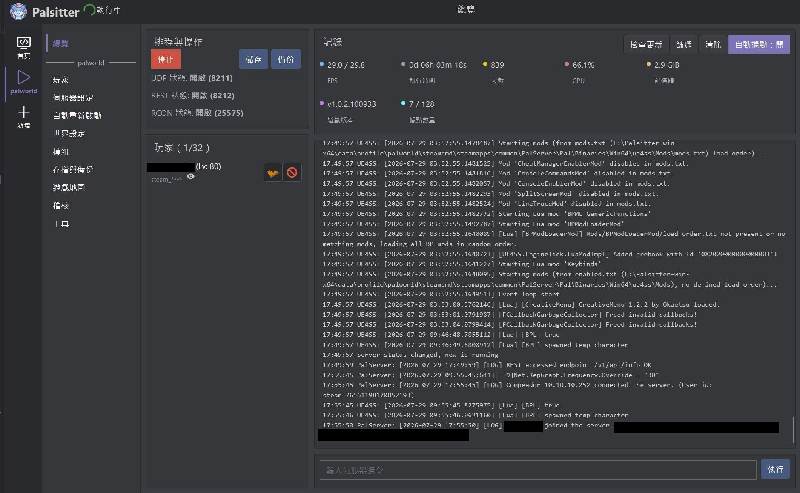

**| [English](README.md) | 繁體中文 | [日本語](README_jp.md) |**

# Palsitter

#### [](https://github.com/ken1882/palsitter/releases) [](https://github.com/ken1882/palsitter/commits) [](https://github.com/ken1882/palsitter/issues)

<p align="center"></p>

**Palworld Server Babysitter** · [GitHub](https://github.com/ken1882/palsitter) · [Windows x64 可攜版](https://github.com/ken1882/palsitter/releases)

Palsitter 是一套具備網頁 GUI 的跨平台遊戲伺服器管理工具，適合長時間持續執行
專用伺服器，並將安裝、更新、生命週期操作、備份、玩家、設定與記錄集中於同一個介面。

目前完整支援幻獸帕魯。滿意工廠目前只是沒有功能的花瓶所以不要用他。

新增並啟動伺服器後，日常的安裝、更新、復原與備份都可以交給網頁 GUI 處理，不需要另外
開啟小黑窗。Palsitter 的目標是讓小型伺服器能長時間運作，同時將狀態與輸出集中在同一個地方。

這是一張 GUI 的圖片：
<p align="center"></p>

## 功能

- **多伺服器管理**：從單一介面建立、複製、重新命名、刪除及管理不同的遊戲伺服器設定檔。
- **啟動後解放雙手**：啟動後立即透過 steamcmd 根據設定檔安裝並下載啟動伺服器，崩潰後自動重啟，偵測到遊戲有更新後若無玩家連線將會自動重啟更新。不需要再手動重啟與更新。
- **重啟與自動復原**：支援排程重啟、記憶體重啟、炸服重啟與重啟紀錄；短時間內連續炸服時會自動自我修復，回檔前先建立安全備份。
- **伺服器與世界設定**：在介面上直接編輯伺服器與遊戲選項，並提供說明項目了解更改影響。
- **存檔與備份**：建立及還原備份、安排週期性備份、切換世界，以及將單人或合作存檔的玩家資料遷移到專用伺服器。會在可能覆寫存檔的操作前建立安全備份。
- **玩家與地圖**：查看線上、離線與封鎖玩家，執行踢人或 ban 人；內建地圖可顯示傳送點、玩家與據點位置。
- **模組與工具**：管理已安裝的 Pak 模組；Windows 另外提供 UE4SS 與 Lua 模組位置管理，但不會替你下載模組。內建防火牆檢查與修復工具可協助確認伺服器執行檔及 UDP 連接埠，路由器的 port forwarding 仍需自行設定。
- **記錄與稽核**：在網頁 GUI 查看即時伺服器輸出、狀態、數據、支援的操作與操作紀錄。
- **多平台支援**：使用 Windows 可攜式桌面版本、原生 Linux 部署、Docker Compose 或 systemd。

## 快速開始（幻獸帕魯）

### Windows 可攜版

1. 從 [Releases](https://github.com/ken1882/palsitter/releases) 下載 `Palsitter-win-x64.7z`，解壓縮到可寫入的目錄後啟動 `Palsitter.exe`。
2. 點選左上角的 **新增執行個體**。要匯入既有世界時，點選 **瀏覽** 並選取對應的 `Level.sav`；沒有存檔則直接確認即可。
3. 啟動執行個體，等待 SteamCMD 與幻獸帕魯專用伺服器安裝並啟動完成。新伺服器在需要時會自動產生 admin password，並自動啟用 GUI 使用的 REST API。
4. 看到狀態顯示開啟，且 Overview 面板出現數據後，伺服器就準備好了。伺服器輸出與 Palsitter 操作紀錄都會顯示在網頁 GUI。

### 從原始碼執行

Clone 專案並安裝 `requirements.txt` 中的套件後，執行：

```bash
git clone https://github.com/ken1882/palsitter.git
cd palsitter
python -m pip install -r requirements.txt
python gui.py
```

開啟 [http://127.0.0.1:22368/](http://127.0.0.1:22368/) 後，依照相同的新增執行個體流程操作；Linux 部署也可以使用下方的安裝方式。

### 匯入單人或合作存檔

匯入存檔後，先讓玩家進入專用伺服器建立角色，再停止伺服器，接著使用 **首頁 → 工具 → 玩家 ID 遷移**。如果匯入的存檔沒有可用的玩家名稱，請先建立玩家名稱快取，避免選錯來源與目的地玩家檔案。遷移工具會先建立安全備份。

Windows 桌面版按右上角 **X** 會縮到系統匣；請從系統匣圖示選擇 **Exit**，或使用 **首頁 → 工具 → 關閉 Palsitter** 完全關閉程式。

## 安裝

### Windows

從 [Releases](https://github.com/ken1882/palsitter/releases) 下載最新的可攜式壓縮檔，將其
解壓縮到可寫入的目錄後啟動 `Palsitter.exe`。可攜式版本會將設定、設定檔與記錄儲存在本地
`data/` 目錄。

### 原生 Linux

若想要直接在機器上開伺服器需要先裝備對應的 python 環境然後 clone 此專案

接著在專案根目錄執行：

```bash
chmod +x script/linux/palsitter.sh
./script/linux/palsitter.sh install
./script/linux/palsitter.sh run
```

GUI 啟動後，開啟 [http://127.0.0.1:22368/](http://127.0.0.1:22368/)。預設情況下，UI
只監聽 localhost。若要遠端管理，建議使用 SSH 通道：

```bash
ssh -L 22368:127.0.0.1:22368 user@server
```

安裝程式預設使用 `venv`，也支援 `asdf`、`pipenv` 與 `uv`：

```bash
PALSITTER_PYTHON_MANAGER=uv ./script/linux/palsitter.sh install
PALSITTER_PYTHON_MANAGER=uv ./script/linux/palsitter.sh run
```

需要時，可在 `run` 後傳入 `gui.py` 的其他參數：

```bash
./script/linux/palsitter.sh run --host 0.0.0.0 --port 22368
```

首頁 → 設定可以將 Web UI 繫結到選定的網路介面。若面板可供遠端連線，請將機器置於
受信任的內部網路或 VPN 後方，並啟用 Basic Auth 與適當的防火牆規則。命令列與環境
變數的主機設定優先於儲存的設定。

### Docker

專案包含 Linux 映像檔與 Compose 設定。建置並啟動：

```bash
./script/linux/start-docker.sh
```

Compose 會將 Palsitter 網頁介面發布到 Docker 主機的 22368 連接埠。執行期資料儲存在映像檔之外：

| 主機路徑 | 內容 |
| --- | --- |
| `./docker-volumns/config` | Palsitter 設定 |
| `./docker-volumns/profile` | Palworld 安裝檔、存檔、備份與執行個體資料 |
| `./docker-volumns/logs` | 應用程式記錄 |

容器會以 UID `1000` 執行；必要時，啟動前請讓該使用者可寫入這些 volume 目錄：

```bash
sudo chown -R 1000:1000 docker-volumns
```

在 Docker 主機開啟 [http://127.0.0.1:22368/](http://127.0.0.1:22368/)。若要變更容器綁定位址
或連接埠，請在 Compose 環境中設定 `PALSITTER_HOST` 或 `PALSITTER_PORT`。主機端連接埠預設只綁定
localhost；若需要讓其他機器連線，請修改 `compose.yaml` 中的主機映射。

### systemd

先安裝 Python 環境，再為目前的 checkout 安裝並啟動服務：

```bash
./script/linux/palsitter.sh install
sudo ./script/linux/systemd-install.sh
```

查看服務狀態與記錄：

```bash
systemctl status palsitter
journalctl -u palsitter -f
```

## 資料與更新

Linux Shell 部署預設將執行期資料儲存在 `data/`：

```text
data/config/    Palsitter 設定
data/profile/   執行個體、Palworld 安裝檔、存檔與備份
data/logs/      應用程式記錄
```

升級或遷移前，請備份 `data/config` 與 `data/profile`。若要使用其他位置，請在安裝與執行
時一致設定 `PALSITTER_DATA_DIR`：

```bash
export PALSITTER_DATA_DIR=/srv/palsitter-data
./script/linux/palsitter.sh install
./script/linux/palsitter.sh run
```

來源 checkout 的更新方式：

```bash
git pull
./script/linux/palsitter.sh install
./script/linux/palsitter.sh run
```

Docker 部署則透過重新建置映像檔更新：

```bash
docker compose build --pull
docker compose up -d
```

## 文件

- [共用文件](docs/shared/README.md) — 應用程式介面、儲存、語系、檔案瀏覽器與共用 UI 行為。
- [Palworld 文件](docs/games/palworld/README.md) — 概覽、設定、地圖、玩家、模組、存檔、備份、
  連接埠、安裝與生命週期行為。
- [Satisfactory 文件](docs/games/satisfactory/README.md) — 明確的佔位功能契約與限制。
- [完整文件索引](docs/README.md)

## 開發

從 `requirements.txt` 安裝開發相依套件後，執行測試：

```bash
python -m pytest -q
```

專案測試流程：

```bash
python run_tests.py
```

提交變更前，也請執行 `python -m compileall -q .`；修改 GUI 時，請同步更新對應的
Playwright 測試。

## 貢獻與支援

歡迎透過 [GitHub Issues](https://github.com/ken1882/palsitter/issues) 回報錯誤或提出功能建議。
請附上 Palsitter 版本、作業系統、所選遊戲、重現步驟及相關記錄。行為變更的 Pull Request 應包含針對性的測試。

目前的貢獻入口請參考 [Contributing](https://github.com/ken1882/palsitter/contribute)。
